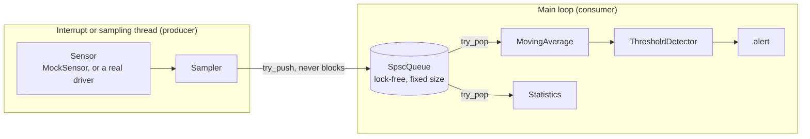

# Architecture

How the pieces fit together, and the rules every piece follows.

## Data flow

A sensor pipeline has two halves that run in different contexts. The
producer half runs in an interrupt (or a sampling thread) and must never
block. The consumer half runs in the main loop and does the real work. A
lock-free queue connects them.



The same code runs on the host (simulated sensor, simulated clock) and on a
microcontroller (a real driver, a hardware timer). Only the sensor changes.

## Modules

| Header | Role | Notes |
|---|---|---|
| `ecl/sensor_reading.hpp` | One timestamped measurement with a validity flag | The common currency between all modules |
| `ecl/ring_buffer.hpp` | Fixed-capacity FIFO for one context | Overwrite-oldest `push()`, or reject with `try_push()` |
| `ecl/spsc_queue.hpp` | Lock-free FIFO between **two** contexts | One producer, one consumer, never blocks, counts drops |
| `ecl/hal/sensor.hpp` | The sensor contract (`is_sensor_v`) | Compile-time, no virtual functions |
| `ecl/hal/mock_sensor.hpp` | Deterministic simulated sensor | Noise, drift, spikes, failed reads, NaN |
| `ecl/hal/sampler.hpp` | Reads a sensor into an `SpscQueue` | The interrupt-side half of the pipeline |
| `ecl/statistics.hpp` | Streaming count, min, max, mean, RMS | Constant memory |
| `ecl/moving_average.hpp` | Sliding-window average | Skips invalid readings |
| `ecl/threshold_detector.hpp` | Low and high limits with hysteresis | Edge-triggered |

## Which buffer do I use?

| Situation | Use |
|---|---|
| Keep the last N samples in one context (a window for a filter) | `RingBuffer` |
| Hand samples from an interrupt to the main loop | `SpscQueue` |
| Several producers, or several consumers | Neither. `SpscQueue` is correct only for exactly one of each |

## The sensor contract

A sensor is any type with this member function, and nothing else is required:

```cpp
ecl::SensorReading read(ecl::SensorReading::Timestamp now_ms) noexcept;
```

`ecl::hal::is_sensor_v<T>` checks it at compile time, and `Sampler` refuses to
compile with a type that does not satisfy it. The caller passes the time in,
which keeps the driver free of any clock dependency. A failed measurement is
an invalid `SensorReading`, never an exception.

To support real hardware, write a class with that one function (an I2C
accelerometer, an ADC channel) and give it to `Sampler` instead of
`MockSensor`.

## Verification

| Claim | How it is checked |
|---|---|
| No memory errors or undefined behavior | gcc and clang with AddressSanitizer and UBSan (CI) |
| No data race in the lock-free queue | gcc and clang with ThreadSanitizer, two-thread stress tests (CI) |
| Runs on a microcontroller unchanged | Cross-compiled for Cortex-M4F with `arm-none-eabi-g++` (CI) |
| No exceptions, no RTTI | The cross-build uses `-fno-exceptions -fno-rtti`; a `throw` fails to compile |
| No heap allocation | The linked firmware is scanned for `malloc` and `operator new` (CI) |
| Footprint | `scripts/footprint.sh` reports flash and RAM per module (CI job summary) |

## Repository layout

```
include/ecl/             public headers (one per module)
  hal/                   sensor contract, mock sensor, sampler
  detail/                internal helpers
tests/                   GoogleTest unit tests, one file per module
examples/host/           runnable examples, no hardware needed
examples/common/         code shared by examples and tests
footprint/               firmware-shaped programs used to measure flash and RAM
cmake/toolchains/        arm-none-eabi toolchain file for the cross-build
scripts/footprint.sh     flash/RAM report and the heap/exception check
docs/                    this file and constraints.md
.github/workflows/       CI
```

Planned, not yet in the repository: `examples/esp32` (the same headers on
ESP-IDF with an MPU6050), `examples/pico`, `benchmarks/`.
